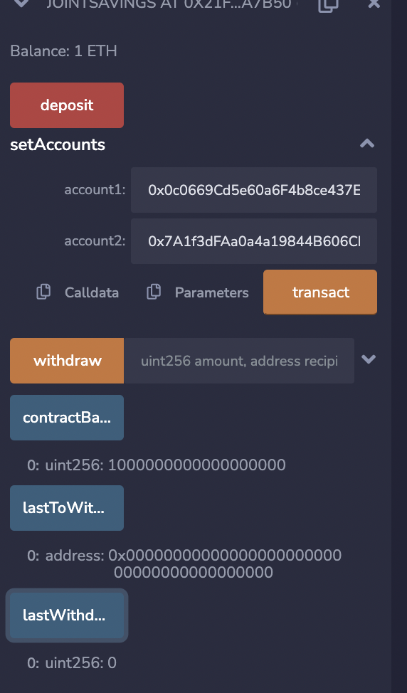
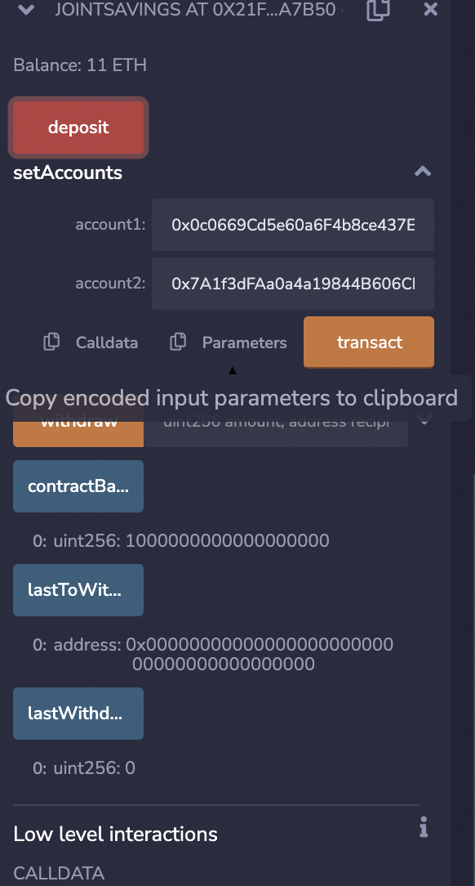
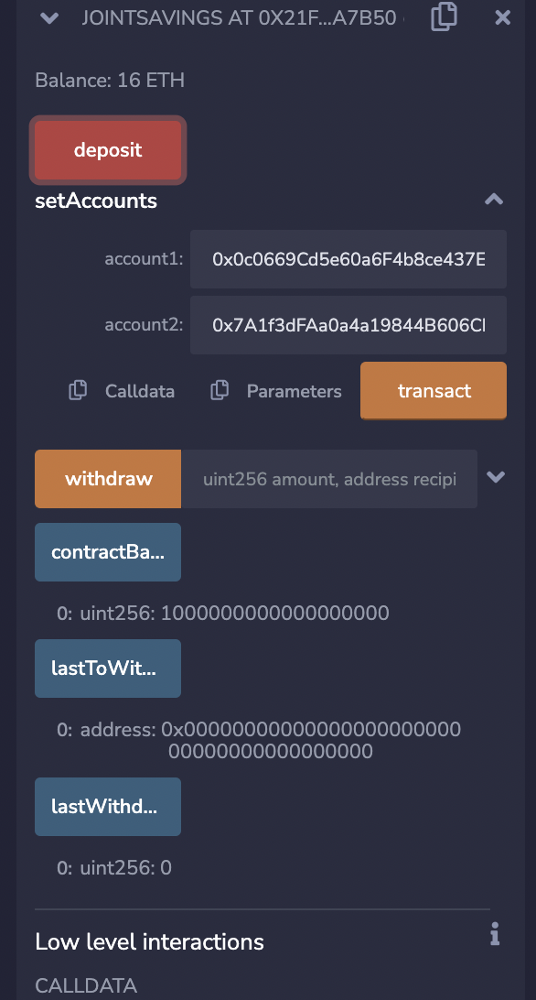
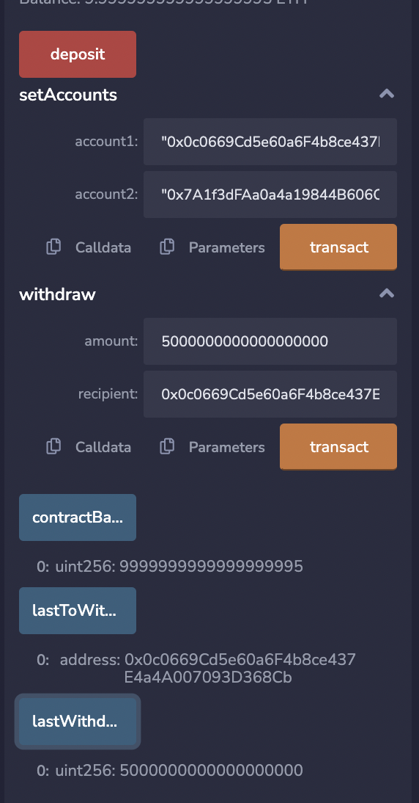
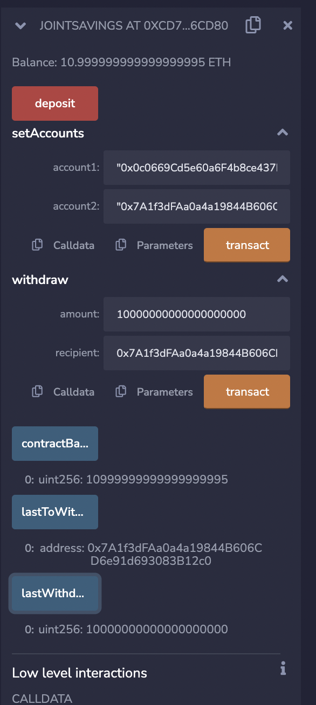

# challenge20

## Deposite 1, 10, 5 ethers into contract:

### Deposite 1 ether

### Deposite 10 ether

### Deposite 5 ether

## Account 1 address: 0x0c0669Cd5e60a6F4b8ce437E4a4A007093D368Cb

 

## Transfer 5 ether into account 1: 

## Account 2 address: 0x7A1f3dFAa0a4a19844B606CD6e91d693083B12c0

## Transfer 10 ether into account 2: 

